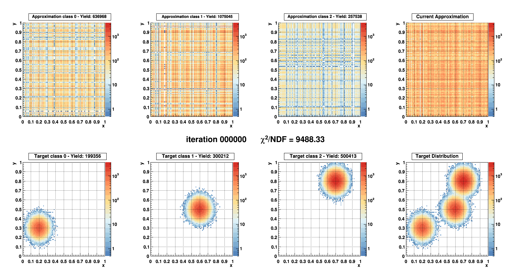

pidrix
======

Distinguishing between various particle species is an essential requirement in a vast range of analyses in nuclear and high energy physics.
Various detectors provide measurements of quantities such as time of flight, ionization energy loss, calorimeter energy deposition, and Čerenkov angle which generally differ between particle species for a given momentum and can be use for particle identification (PID).
Variations in the quantities themselves, uncertainties in the measurements, and biases in calibrations all pose issues that make probabilistic PID difficult or impossible for certain momentum ranges where measurement distributions overlap for different species.
This situation is typically handled by making assumptions about the distributions of measurements and using fits to the data to extract yields and to estimate the admixture of particle species for different measurement values.
Even small inaccuracies in these shape assumptions can lead to large biases in measured yields and subsequently probabilistic estimates of PID.

Pidrix is a library that employs a new method which does not rely on any shape assumptions.
This is done by populating a matrix with the bin contents of a two-dimensional histogram where each of the two dimensions is a measured quantity providing independent information about the species of a given particle. 
This matrix is then expressed as the product of two matrices where the rows of one and the columns of the other give the easurement distributions for the various constituent particle species.
By applying the physical constraint that these distributions are positive semi-definite we are able to apply an iterative update rule to the measurement distribution matrices which converge such that the Kullback-Leibler divergence is minimized.
This method provides the measurement distributions and yield for each particle species based on only physically motivated assumptions. 
This method compares favorably to the traditional fitting method and under many circumstances this method gives more accurate measurements.

Further details can be found in a [presentation](https://indico.cern.ch/event/275088/contribution/98) on the topic that was given at the Winter Workshop for Nuclear Dynamics 2014.

## Examples

Here are several examples of the library in action. The lower right histogram in each case is an example of what can be measured by an experiment. The three histograms to the left of it are what we would like to unfold from the histogram to the right. These are the distributions that we obtain for each particle type if we could perfectly differentiate between them. The three histograms above them show the distributions that pidrix produces when given only the histogram on the lower right as an input.

In this animation, you can see the extracted yields and distributions evolve over subsequent iterations. The extracted particle distributions and yields match almost perfectly in this simple case (note that the z-axis is on a log scale so the ghosting effects are at much less than the 1% level).

This example includes sinusoidal structure that makes determining the individual distributions far more difficult. The method is still able to determine the individual particle distributions without having any prior information about these distributions.
